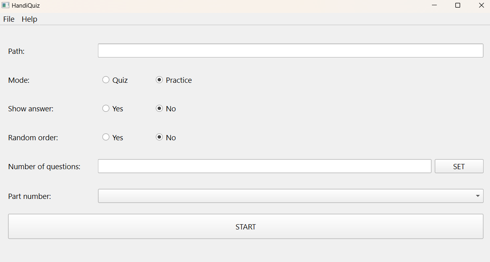
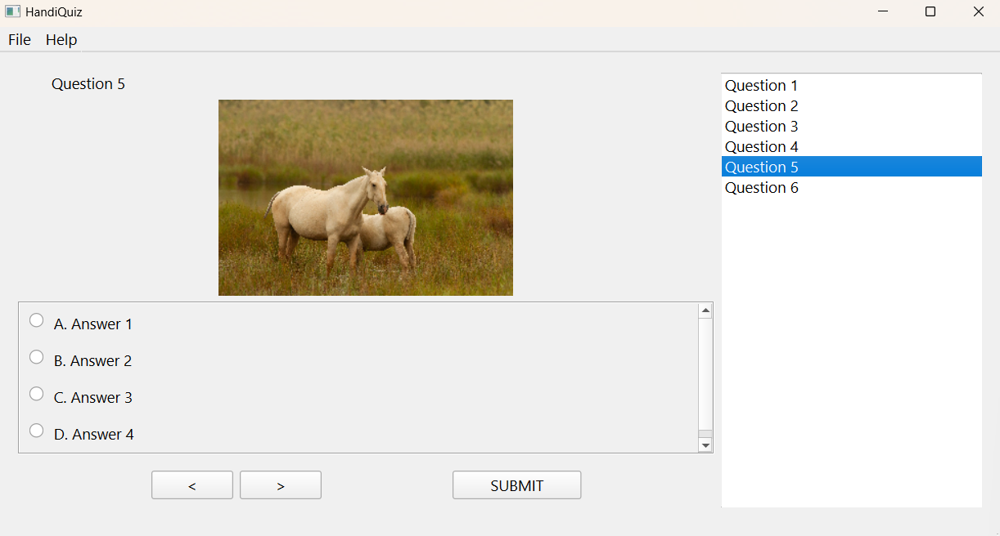

# HandiQuiz

## Requirement
- xlrd: `pip install xlrd`

## Documentation

Several shortcuts you should now:
- `Ctrl + [`: Decrease font size
- `Ctrl + ]`: Increase font size
- `Esc`: Exit (when in setup screen) or go back to setup screen (when in quiz screen)

### Setup

Opening the app will show you the setup screen:

On this screen, click at `File` on taskbar and you will see 2 buttons `Import` and `Open`:
- `Import` (shortcut `Ctrl + i`): Import questions from excel file and output to a file with extension `.hqz` in `data` folder and then do quiz (template is given in `example` folder)
- `Open` (shortcut `Ctrl + o`): Open `.hqz` file to do quiz

There are 2 modes:
- `Quiz`: select randomly `Number of questions` from the question pack
- `Practice`: divide question pack into several parts based on `Number of questions`. Let's say if `Number of questions` is 30 so `Part 1` is from question 1 to question 30, `Part 2` is from question 31 to question 60.

If `Show answer` is `Yes` and when you click on `Submit` the current question will show the answer and other won't. If `Show answer` is `No` and when you click on `Submit`, all of the questions will show its answer.

When you set `Number of questions`, remember to click on `Set` button to update the number and also update the `Part number` if you are in `Practice` mode.

If everything is set, you just need to click on `START` button to begin your quiz!

### Quiz

You can see there are 3 sections: question, answer and question list (the list on the right):
- Question: Show question and image
- Answer: Each answer is bind to a number on your keyboard so if you press **`number 1`**, you will select answer 1... If you want to go to next question or previous question, you can press button **`>`** or **`<`** on your keyboard and if you don't want to click on `Submit` button, you can press button **`Enter`** or **`Return`** on your keyboard too.
- Question list: The list help you navigate through all questions by **double click** on the question you want to jump into.

Finally, if you are done doing quiz, just press `Esc` on your keyboard to return back to setup screen!

### Excel Template

